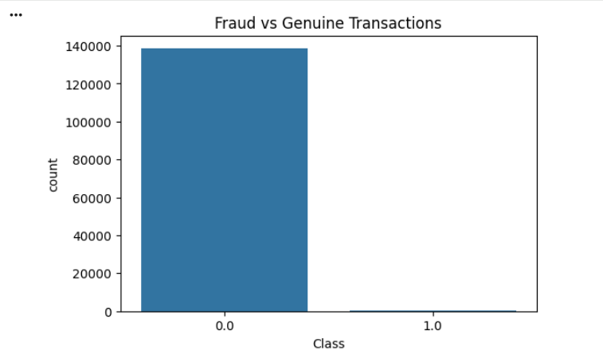
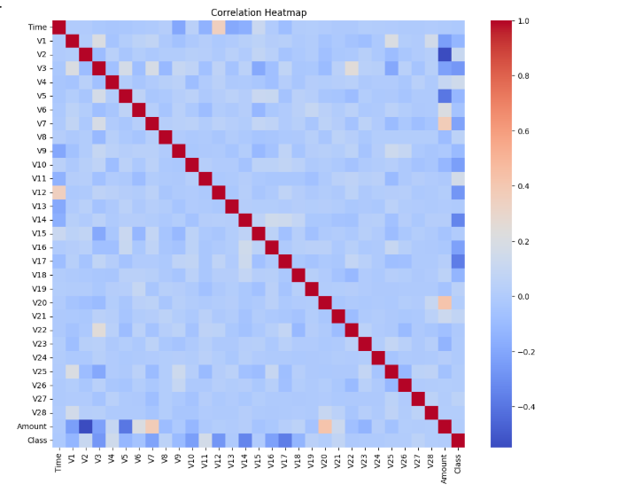
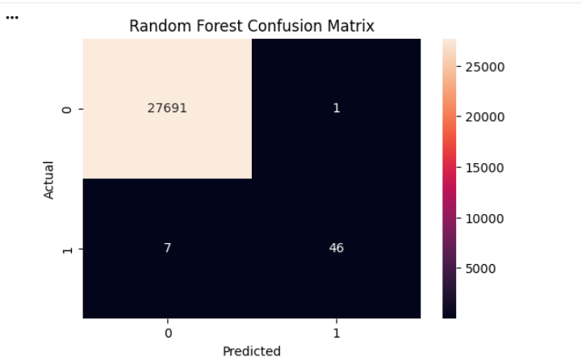

# Credit Card Fraud Detection using Machine Learning

## Overview
This project aims to detect fraudulent credit card transactions using Machine Learning techniques. Due to the highly imbalanced nature of fraud datasets, special attention was given to model evaluation and class imbalance handling.

## Dataset
- Credit Card Fraud Detection Dataset
- Total Transactions: 53,570
- Genuine Transactions: 53,417
- Fraudulent Transactions: 153

## Technologies Used
- Python
- Pandas
- NumPy
- Matplotlib
- Seaborn
- Scikit-Learn
- Google Colab
- GitHub

## Project Workflow
1. Data Loading and Exploration
2. Data Cleaning
3. Exploratory Data Analysis (EDA)
4. Feature Scaling
5. Train-Test Split
6. Model Training
7. Model Evaluation
8. Model Comparison
9. Model Saving

## Machine Learning Models
- Logistic Regression
- Random Forest Classifier

## Evaluation Metrics
- Accuracy
- Precision
- Recall
- F1 Score
- ROC-AUC Score
- Confusion Matrix

## Project Visualizations

### Fraud Distribution

### Correlation Heatmap

### Random Forest Confusion Matrix

## Results
The Random Forest model achieved the best overall performance and was selected as the final model for fraud detection.

## Project Structure

credit-card-fraud-detection/
│
├── Credit_Card_Fraud_Detection_Advanced.ipynb
├── README.md
├── requirements.txt
├── class_distribution.png
├── correlation_heatmap.png
├── random_forest_confusion_matrix.png
└── fraud_model.pkl

## Future Improvements
- Hyperparameter Tuning
- XGBoost Implementation
- Streamlit Web Application
- Real-Time Fraud Detection

## Author
Ankit Kumar
Machine Learning | AI/ML | Data Science Enthusiast
